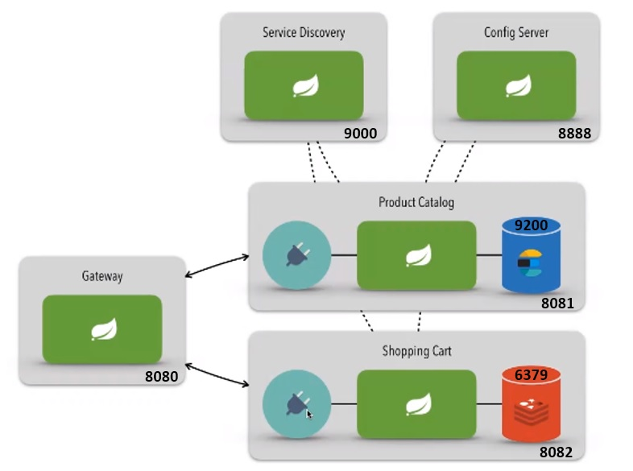
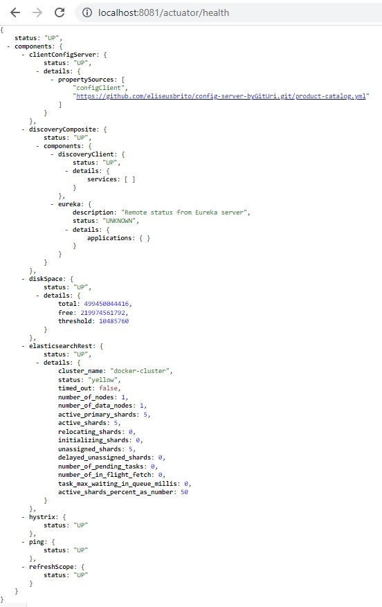
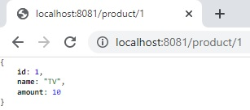
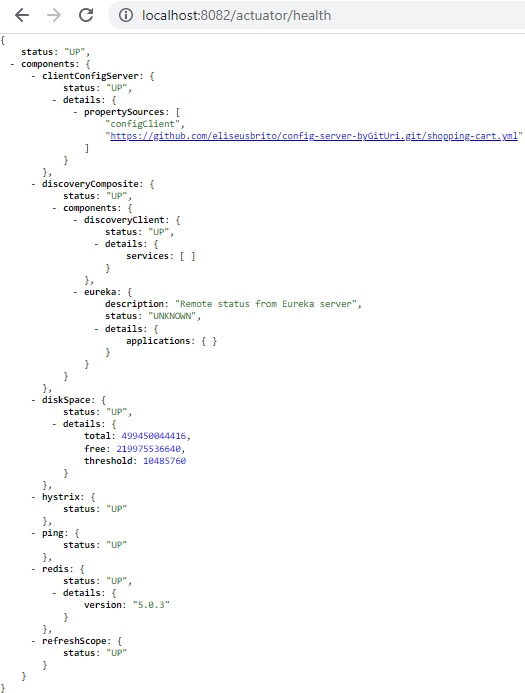
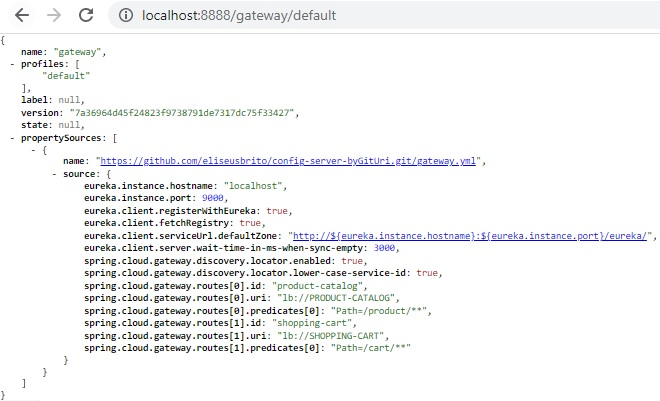
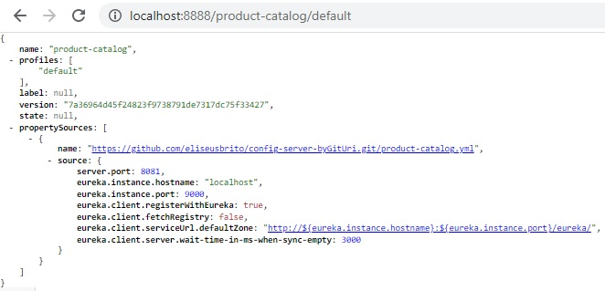
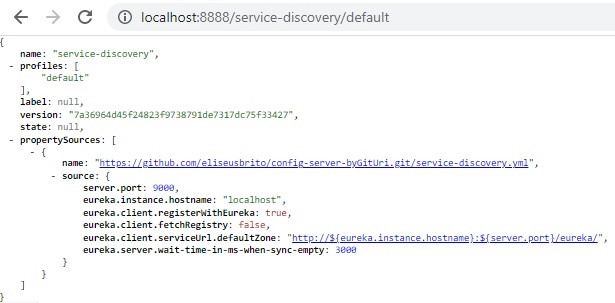
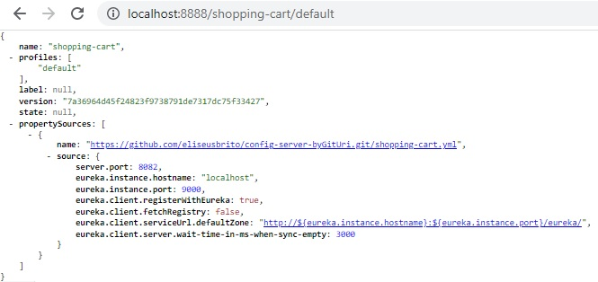
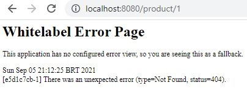
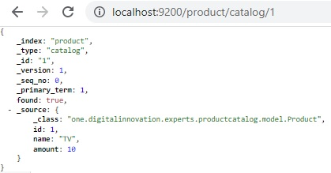

## Microserviços com Spring Cloud com Java: Modelo aplicável para e-commerces

Esta aplicação possui uma arquitetura de software baseada em microsserviços.

Para trabalhar com os produtos de uma aplicação ecommerce(Product Catalog), esta aplicação possui um serviço rodando na porta 8081 utilizando o ElasticSearch como forma de armazenamento dos dados na porta 9200 através do Docker.

Também possui outro serviço rodando na porta 8082 para trabalhar com os produtos que estão no carrinho de compras(Shopping Cart) utilizando o Redis como forma de armazenamento na porta 6379 também através do Docker.

Um Config Server rodando na porta 8888 está configurado para centralizar a configuração de todas as aplicações em um só lugar. Foi escolhido o git para o armazenando destes arquivos de configuração em https://github.com/eliseusbrito/config-server-byGitUri.

Para distribuir e organizar os microservices utilizando um loadbalancer foi utilizado rodando na porta 9000 um Service Discovery utilizando o Spring Eureca.

Para expor o sistema para quem estiver consumindo(normalmente o front end/mobile) possui um Gateway rodando na porta 8080, desta forma o front end não se comunica diretamente com os microserviços e sim com o Gateway. Para isto utiliza o Spring Cloud Routing.

Sempre que aplicável os microsserviços tem o Spring Boot Actuator que permite monitorar e gerenciar as aplicações.

### Acesso pelo navegador

